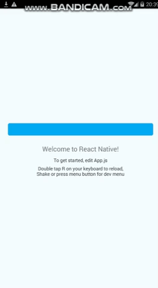

# sajjad-blur-overlay



## Getting started

`$ npm install sajjad-blur-overlay --save`

### Mostly automatic installation

`$ react-native link sajjad-blur-overlay`

### Manual installation


#### iOS

Currently Not Supported , Comming Soon

#### Android

1. Open up `android/app/src/main/java/[...]/MainApplication.java`
  - Add `import com.reactlibrary.SajjadBlurOverlayPackage;` to the imports at the top of the file
  - Add `new SajjadBlurOverlayPackage()` to the list returned by the `getPackages()` method
2. Append the following lines to `android/settings.gradle`:
  	```
      include ':sajjad-blur-overlay'
      project(':sajjad-blur-overlay').projectDir = new File(rootProject.projectDir, '../node_modules/sajjad-blur-overlay/android')

  	```
3. Insert the following lines inside the dependencies block in `android/app/build.gradle`:
  	```
      compile project(':sajjad-blur-overlay')
  	```


## Usage
```javascript
import React, {Component} from 'react';
import {Platform, StyleSheet, Text, View, TouchableOpacity} from 'react-native';
import BlurOverlay from 'sajjad-blur-overlay';

const instructions = Platform.select({
    ios: 'Press Cmd+R to reload,\n' + 'Cmd+D or shake for dev menu',
    android:
    'Double tap R on your keyboard to reload,\n' +
    'Shake or press menu button for dev menu',
});

type Props = {};
export default class App extends Component<Props> {
    constructor(props) {
        super(props);
        this.state = {
            showBlurOverlay: false,
        }
    }

    render() {
        return (
            <View style={styles.container}>
                <TouchableOpacity
                    onPress={() => {
                        this.setState({showBlurOverlay: true});
                    }}
                    style={{width: '90%', height: 36, backgroundColor: "#03A9F4", borderRadius: 4, margin: 16}}/>
                <Text style={styles.welcome}>Welcome to React Native!</Text>
                <Text style={styles.instructions}>To get started, edit App.js</Text>
                <Text style={styles.instructions}>{instructions}</Text>
                {this.state.showBlurOverlay &&

                <BlurOverlay
                    radius={24}
                    brightness={-200}
                    onPress={() => {
                        this.setState({showBlurOverlay: !this.state.showBlurOverlay});
                    }}
                    customStyles={{alignItems: 'center', justifyContent: 'center'}}

                >
                    <View style={styles.image}>
                        <Text style={styles.instructions2}>{instructions}</Text>

                        <Text style={styles.instructions2}>{instructions}</Text>
                    </View>
                </BlurOverlay>

                }
            </View>
        );
    }
}

const styles = StyleSheet.create({
    container: {
        flex: 1,
        justifyContent: 'center',
        alignItems: 'center',
        backgroundColor: '#F5FCFF',
    },
    welcome: {
        fontSize: 20,
        textAlign: 'center',
        margin: 10,
    },
    instructions2: {
        alignSelf: 'center',
        textAlign: 'center',
        color: 'white',
        marginBottom: 5,
    },
    instructions: {
        textAlign: 'center',
        color: '#333333',
        marginBottom: 5,
    },
});

```
  
  
  
  ## Props
  ```
  radius : Int (Between  0 to 24)
  brightness : float (Between -255 to 255 , 0 = nochange)
  onPress : func
  customStyles: style
```
